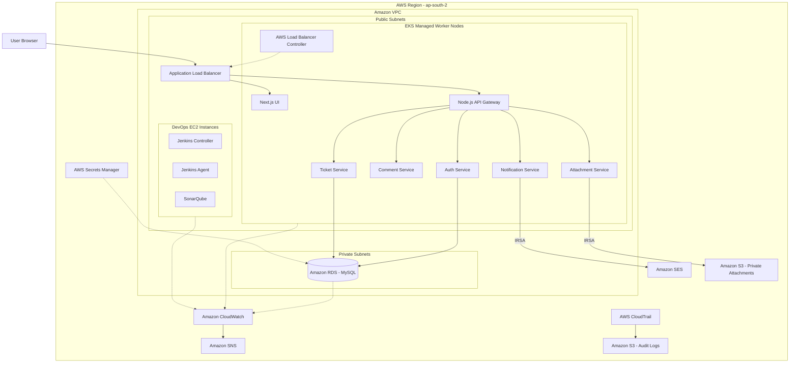
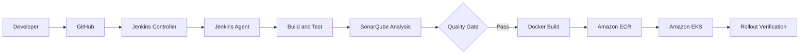
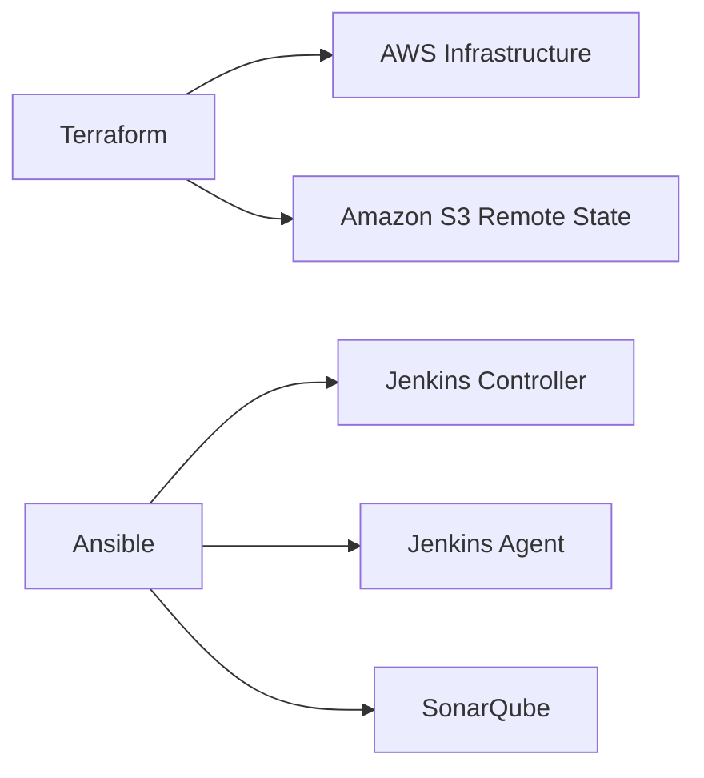

# AWS Architecture

This document shows the implemented runtime, CI/CD, security, storage, monitoring, audit, and operational architecture for the i27 Helpdesk AWS DevOps portfolio project.

## Runtime Architecture

## Application Request Flow

1. The user reaches the application through the public Application Load Balancer.
2. The ALB routes frontend traffic to the Next.js UI and API traffic to the Node.js API Gateway.
3. The API Gateway validates JWT authentication and forwards verified identity and role context.
4. The Gateway routes requests to internal Kubernetes services.
5. Database-backed services use Amazon RDS for MySQL in private subnets.
6. The Attachment service uses IRSA to access the private attachment S3 bucket.
7. The Notification service uses IRSA to send application email through Amazon SES.

## CI/CD Architecture

The Jenkins Agent builds and tests services, runs SonarQube analysis, builds versioned container images, pushes them to Amazon ECR, deploys them to Amazon EKS, and verifies the resulting Kubernetes rollout.

## Infrastructure and Configuration

Terraform manages AWS infrastructure provisioning and infrastructure changes.

Ansible manages configuration of the Jenkins Controller, Jenkins Agent, and SonarQube EC2 instances.

Routine daily startup and shutdown use dedicated operational scripts instead of repeatedly applying Terraform or Ansible.

## Security Highlights

- JWT authentication protects application API routes.
- Role, ownership, and assignment checks protect sensitive application operations.
- Kubernetes workloads use IRSA instead of embedded AWS access keys.
- The attachment S3 bucket blocks public access and uses encryption, TLS-only access, lifecycle management, and scoped IAM permissions.
- Database credentials are managed through AWS Secrets Manager.
- Sensitive JWT claims and bearer authorization headers are not written to Gateway logs.
- CloudTrail records AWS API activity for audit purposes.

## Operations and Cost Controls

The lab is designed to scale down when not in use.

The shutdown workflow removes public ingress resources so the ALB can be deleted, scales the EKS managed node group to zero workers, stops Amazon RDS, and stops the Jenkins Controller, Jenkins Agent, and SonarQube EC2 instances.

The EKS control plane and persistent services or storage can continue to incur charges while the lab is scaled down.
